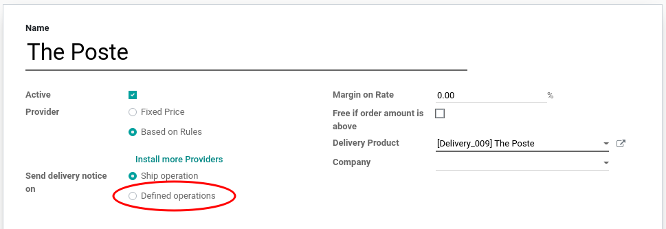
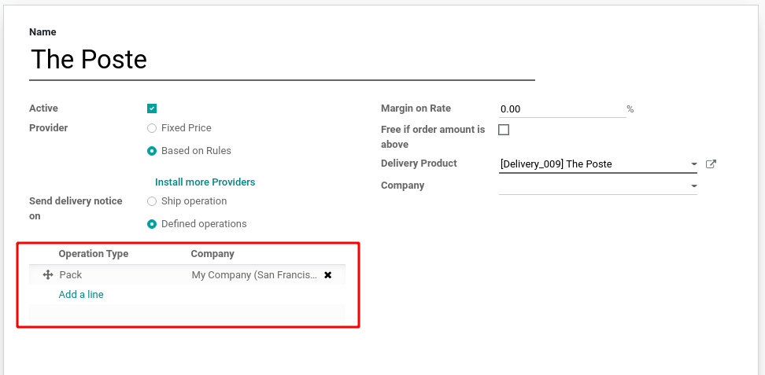

On the shipping method, you can configure on which operation types the
delivery notification is triggered by selecting *Defined operations* in the
*Send delivery notice on* field:

Then select the operation type which will trigger the delivery notification:

