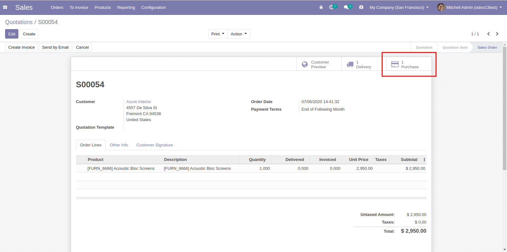
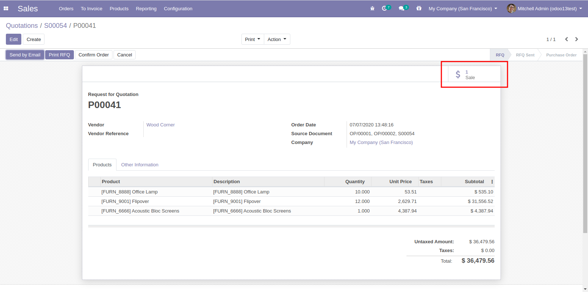

To use this module, you need to:

#. Create a Sale order with at least one product that is marked *Replenish on Order (MTO)* or *Dropship* and none is available in Stock.

#. Confirm the order. Either existing Purchase order is extended with this request or new one is created.

#. Sale order now shows Smart button allowing you to see the associated Purchase order(s)

* You can go the other direction - from Purchase order to Sale order(s) as well

