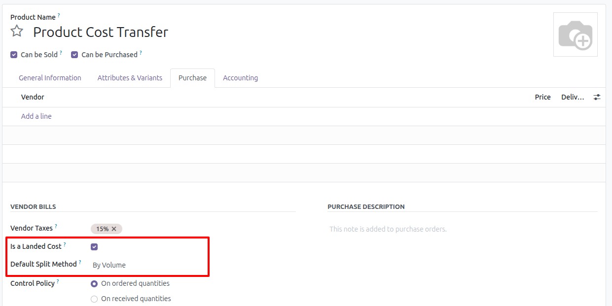
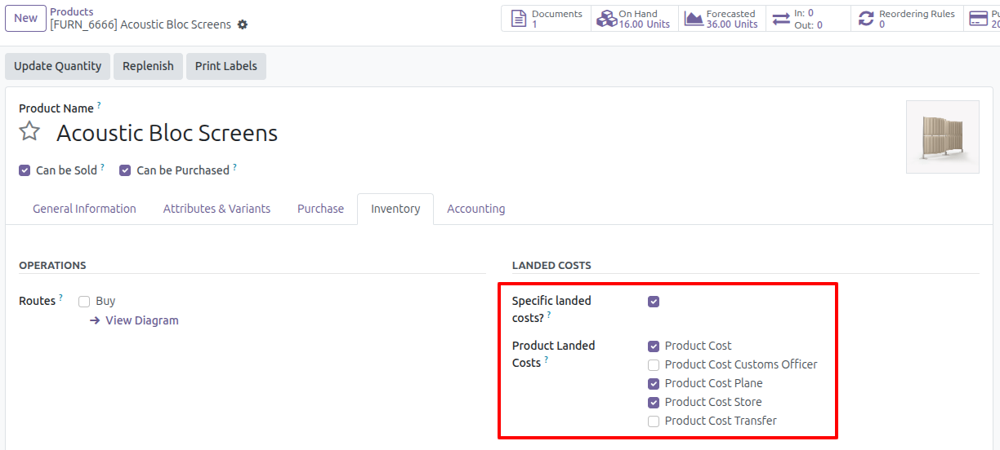
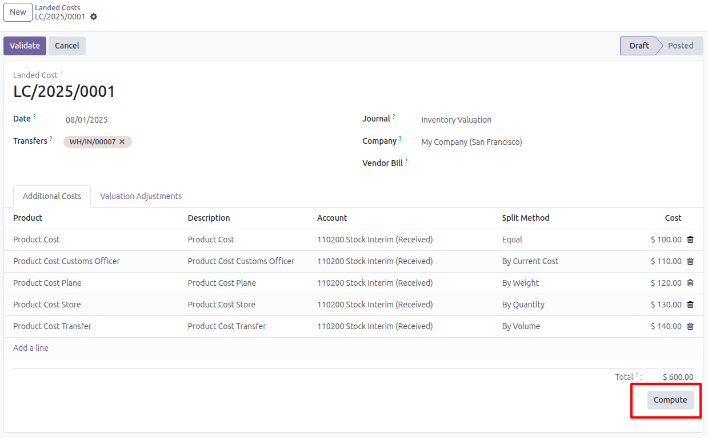
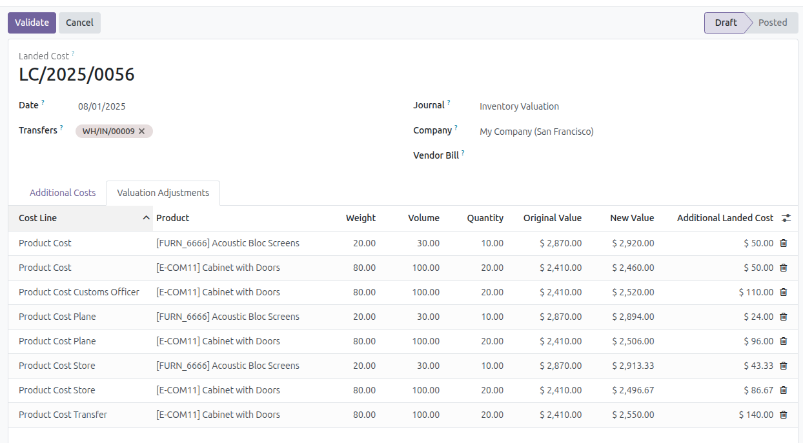

Create Product landed costs
-------------------------------------

1. Go to *Inventory* > *Products* > *Products*
2. Create product with the service type.
3. Go to tab *Purchase* section *VENDOR BILLS*
4. Check the box *Is a Landed Cost*.
5. If you want to select a *Default Split Method*.
6. Save

Select landed costs for a product
-------------------------------------

1. Go to *Inventory* > *Products* > *Products*
2. Create a product that is not a service type and uses a First In First Out (FIFO) or Average Cost (AVCO) costing
   method.
3. Go to tab *Inventory* section *LANDED COSTS*
4. Check the box *Specific landed costs?*.
5. Select the landed costs products you want.
6. Save

Selecting products is optional, but you should keep in mind that when recalculating costs
in landed costs, the main product will not be taken into account and its
Valuation Adjustments will not be included.

Rules for recalculating landed costs
-------------------------------------

1. If the product does not have "Specific landed costs?" marked, it will act in the natural way.
2. If you have "Specific landed costs?" marked and you do not have any products marked,
   they will not be considered in the Valuation Adjustments lines.
3. If you have "Specific landed costs?" marked and you have any products marked,
   these are the ones that will be considered in the Valuation Adjustments lines.

Recalculate additional costs by landed cost
------------------------------

1. Go to *Inventory* > *Operations* > *Landed Costs*
2. Create a Landed Cost.
3. Press the *Compute* button.

4. Go to *Valuation Adjustments* tab and the values will be displayed according to the applied rules.

5. *Valuation Adjustment* lines that are eliminated according to the applied rules will be distributed
   among the remaining lines of the same *Cost line*.

