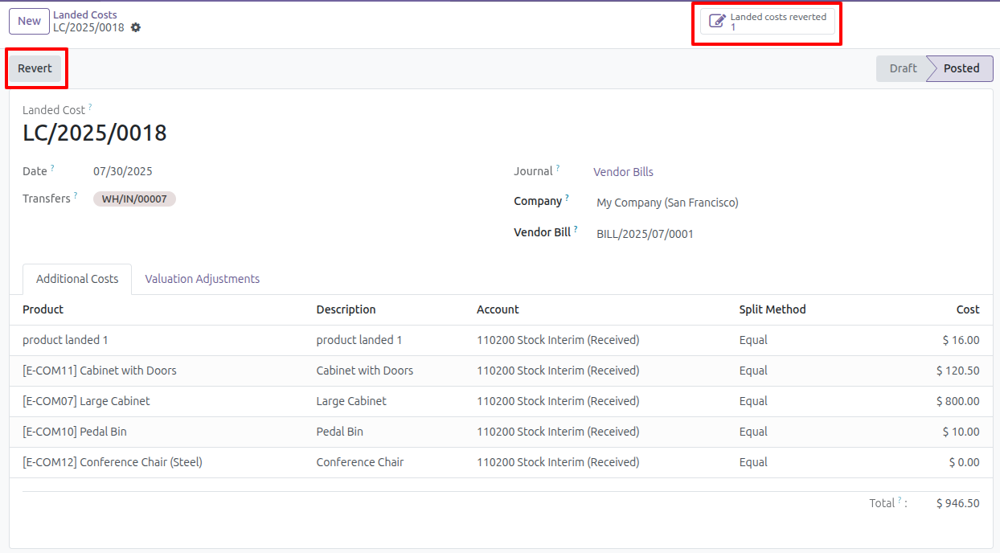

Create new landed costs
--------------------

1. Go to *Inventory* > *Operations* > *Landed Costs*
2. Create a new landed costs
3. When the landed costs are validated, a *Revert* button appears, this button only appears in the Posted state.
4. Pressing this button generates a new landed cost in draft status.
5. To view the reverted landed costs, press the "Landed costs reverted" smart button.

