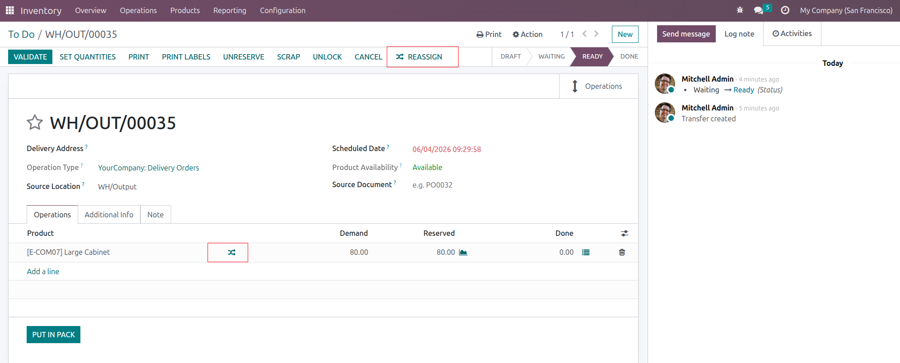
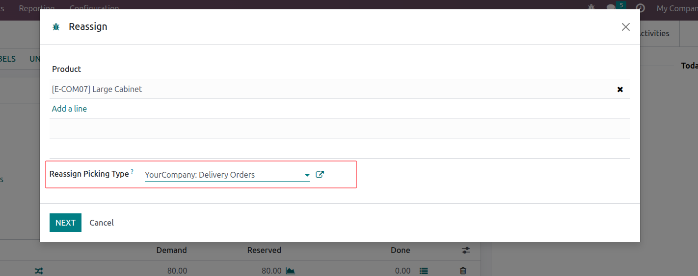
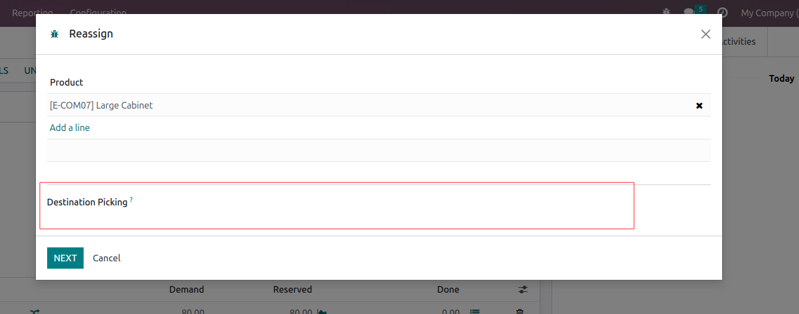
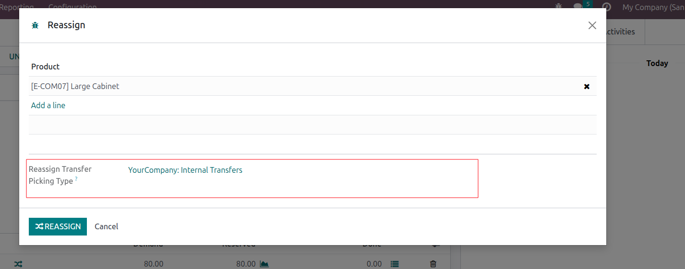
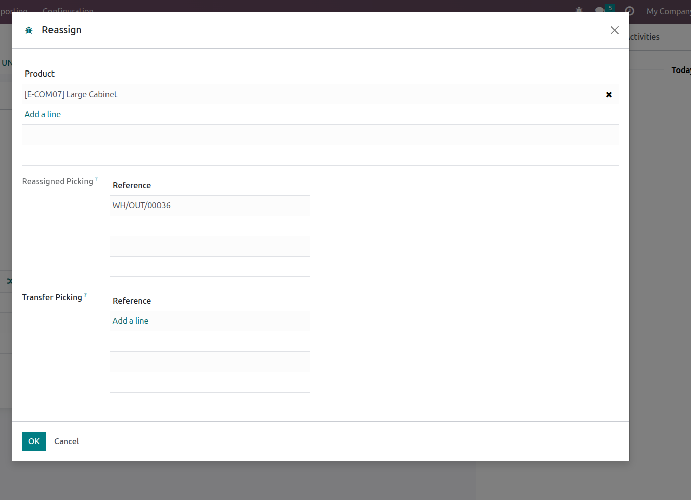

- Go to a picking you want to reassign products.
- Either click on the button in header to try to reassign reserved products or click
  in front of a package or a product to reassign partially:

- This will open a wizard that allows you to choose an operation type to reassign moves to:

- Then, choose the picking you want to reassign the moves to. Let it void to let the
  system to decide:

- Then, choose the operation type for the picking that will welcome the transfer
  moves:

- Then, click on 'Reassign', the result will be displayed:

