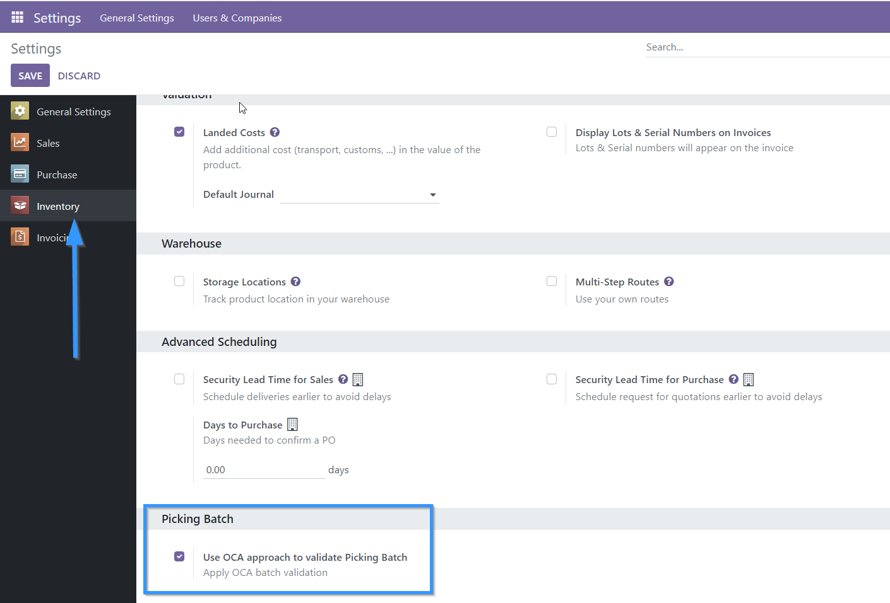
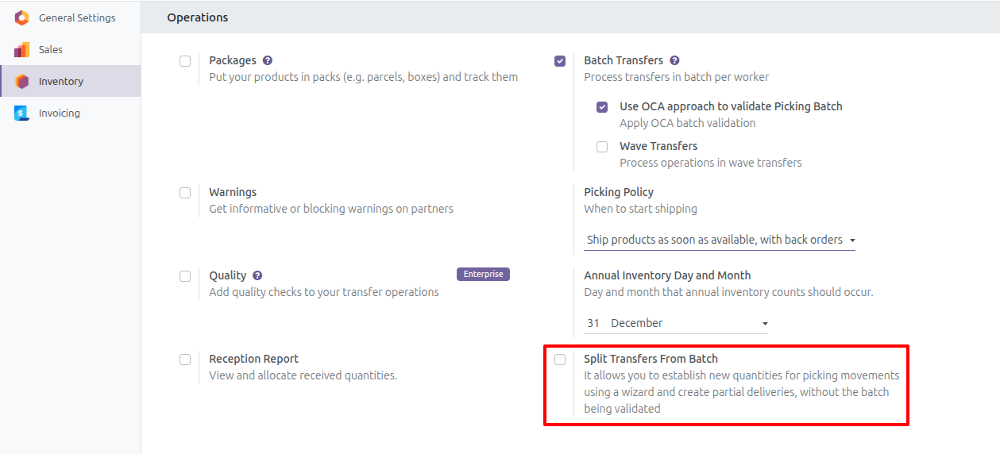

In Inventory / Settings / Batch Picking it is possible to activate or
deactivate which approach for batch handling will be used per company.
By default after installation this option will be activated for all
companies.

In Inventory/Configuration, you can enable the Split Transfers From Batch option,
which allows you to define new quantities for batch-related transactions using a wizard.

