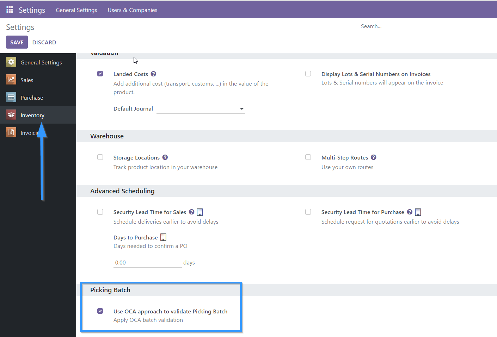

In Inventory / Settings / Batch Picking it is possible to activate or deactivate which approach for batch handling will be used per company. By default after installation this option will be activated for all companies.

