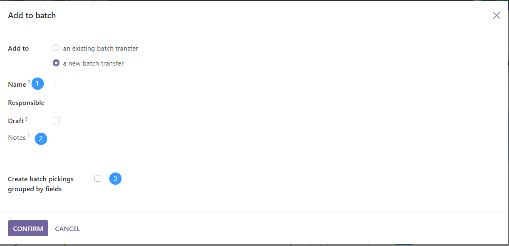
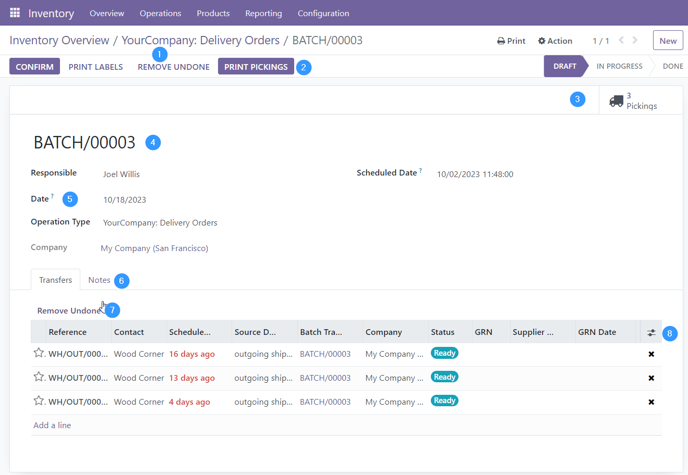
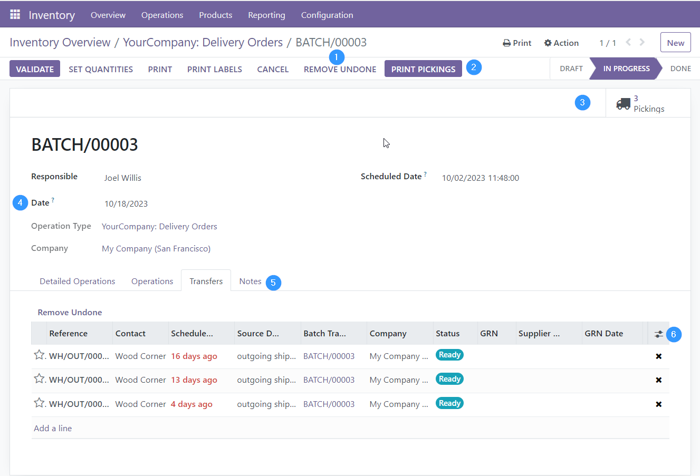
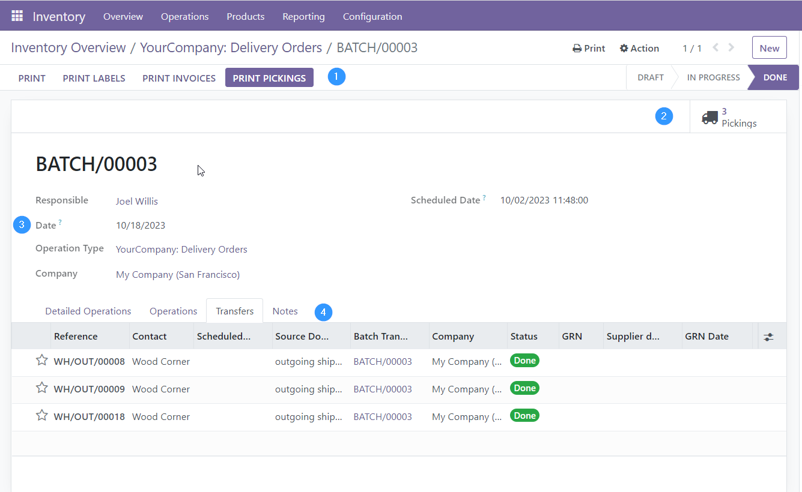

When you create a batch pick, the creation wizard will appear with the
new fields added.

1.  Name: Allows to rename the batch. But be careful, if this is done,
    it overwrites the name that Odoo assigns to the batch by default.
2.  Notes: Allows to add notes to the batch.
3.  Allows you to group the batch by the fields of the model
    stock_picking

Adds to the form view of batch picking:

**In "Draft" status:**

1.  Delete all delivery notes in the batch whose status is not done or
    canceled.
2.  Print pickings.
3.  Smart button with counting and access to pickings.
4.  Rename the batch if it is in draft status.
5.  Date. On which the batch picking is to be processed.
6.  Notes. Reflects the notes that have been entered from the wizard and
    allows you to modify them.
7.  Delete all delivery notes from the batch whose status is not done or
    canceled.
8.  Allows to add more fields to the list of pickings.

**"In progress" status:**

1.  Delete all pickings in the batch whose status is not done or
    cancelled.
2.  Print pickings.
3.  Smart button with counting and access to pickings.
4.  Date. On which the batch picking is to be processed. It can be
    changed in this state.
5.  Notes. Reflects the notes that have been entered from the wizard and
    allows you to modify them.
6.  Allows to add more fields to the list of pickings.

Note: If a batch is cancelled, it cancels all batch picks and sets the
batch statuses to cancel as well only if the user has set the OCA batch
validation approach in the inventory settings.

**In "Done" status:**

1.  Print pickings.
2.  Smart button with counting and access to pickings.
3.  Date. On which the batch picking is to be processed. Already it
    can’t be modified in this state.
4.  Notes. Reflects the notes that have been entered from the wizard and
    allows you to modify them.
