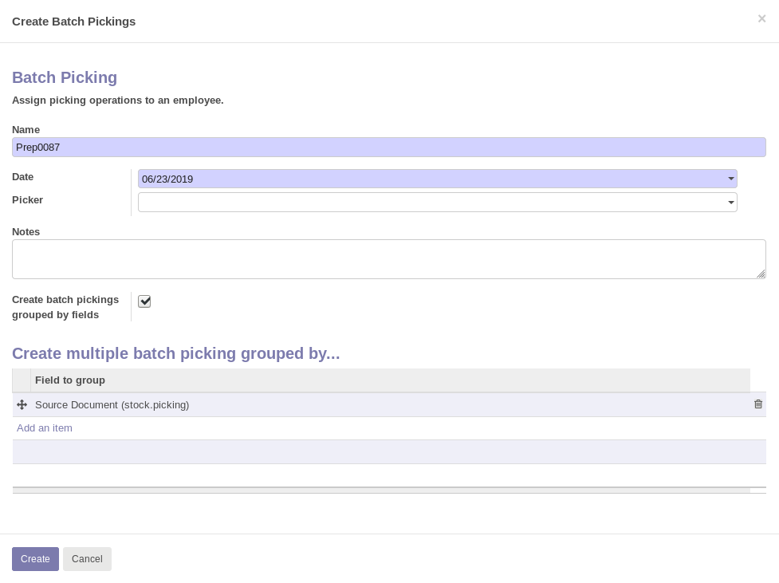

When you create a batch pick, the creation wizard will appear with the new fields added.

#. Name: Allows to rename the batch. But be careful, if this is done, it overwrites the name that Odoo assigns to the batch by default.
#. Notes: Allows to add notes to the batch.
#. Allows you to group the batch by the fields of the model stock_picking

Adds to the form view of batch picking:

**In "Draft" status:**

.. figure:: ../static/batch_form_draft.png
    :alt: Batch form in draft status
    :width: 80 %
    :align: center

#. Delete all delivery notes in the batch whose status is not done or canceled.
#. Print pickings.
#. Smart button with counting and access to pickings.
#. Rename the batch if it is in draft status.
#. Date. On which the batch picking is to be processed.
#. Notes. Reflects the notes that have been entered from the wizard and allows you to modify them.
#. Delete all delivery notes from the batch whose status is not done or canceled.
#. Allows to add more fields to the list of pickings.

**"In progress" status:**

.. figure:: ../static/batch_form_in_progress.png
    :alt: Batch form in progress status
    :width: 80 %
    :align: center

#. Delete all pickings in the batch whose status is not done or cancelled.
#. Print pickings.
#. Smart button with counting and access to pickings.
#. Date. On which the batch picking is to be processed. It can be changed in this state.
#. Notes. Reflects the notes that have been entered from the wizard and allows you to modify them.
#. Allows to add more fields to the list of pickings.

Note: If a batch is cancelled, it cancels all batch picks and sets the batch statuses to cancel as well only if the user has set the OCA batch validation approach in the inventory settings.

**In "Done" status:**

.. figure:: ../static/batch_form_done.png
    :alt: Batch form in done status
    :width: 80 %
    :align: center

#. Print pickings.
#. Smart button with counting and access to pickings.
#. Date. On which the batch picking is to be processed. Already it can’t be modified in this state.
#. Notes. Reflects the notes that have been entered from the wizard and allows you to modify them.
