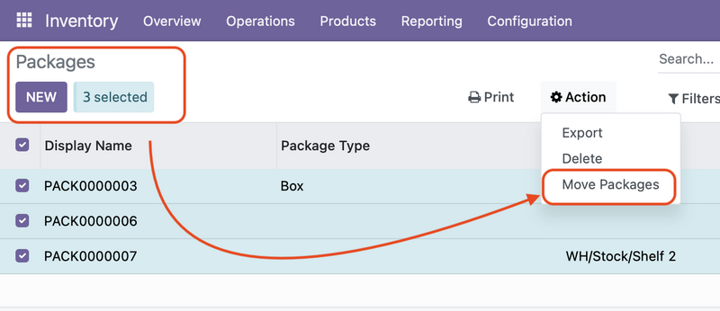

- Go to **Inventory -> Products -> Packages**.

- Open a package or select several packages in the list view. **Important**: All selected packages must be located in the same location.

- Open the **Action** menu and select **Move packages**.

- In the opened wizard, select the destination location where you want to move the packages.

- You can select an optional destination package in the **Destination Package** field. If selected, the content of the selected packages will be moved into the destination package located at the destination location.

- If you check **Validate**, the created internal picking will be validated. Otherwise, it will remain in the **Ready** state.

- Click the **Move** button.

