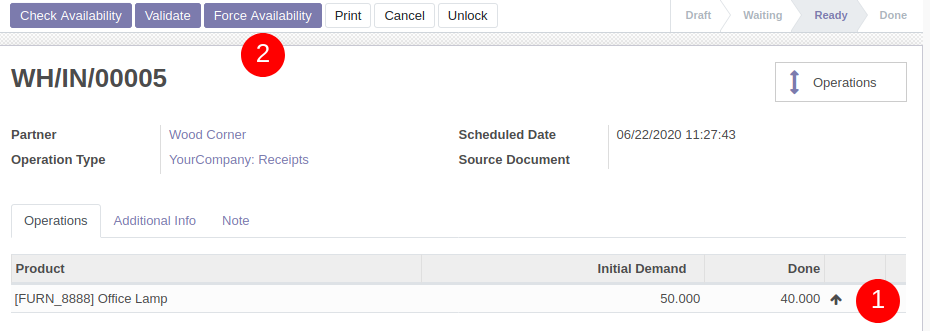

This module allows you to quickly indicate the done quantities in pickings. 
This is useful for activities (such as grocery stores) where product stock 
quantities are not well updated, due to lack of time for example.
This is the same objective as the legacy function "Force availability". 

