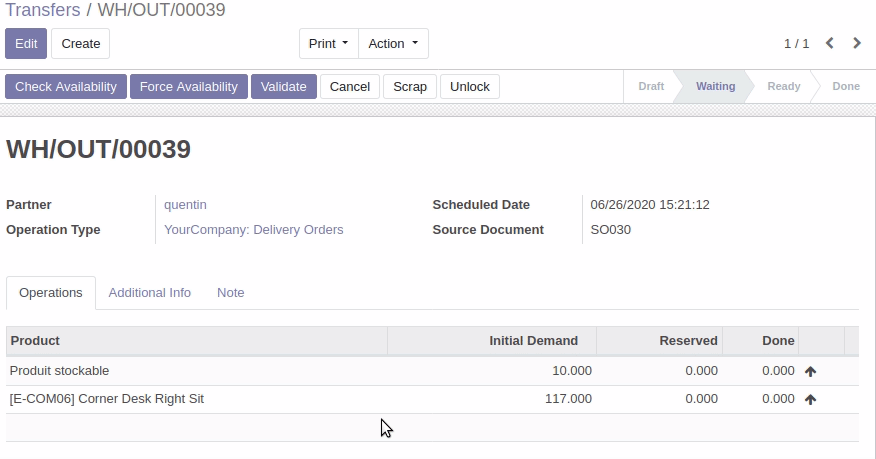

This module checks if some "quantities done" in the picking are not equals to
initials demands. If so, "Force availability" button is possible.
User can also set "quantity done" for each line of the picking.

