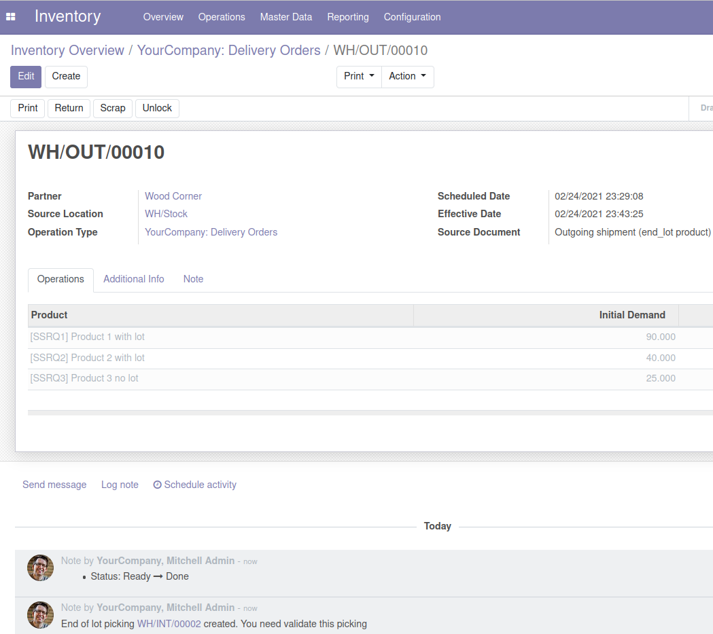

Typical use case:

- you deliver products with lots and expiry dates to your warehouse coming from production.
- you only send round quantity depending of your packaging (i.e. pallets)
- you don't want for the next outgoing picking, that Odoo proposes a lower quantity than needed by your conditioning.
- instead you want to ship the next lot with complete quantity for pallet.
- you want to consume end of lot quantity from another warehouse or location

This module allow to make empty a stock location for a product (may be a particular lot) when a delivery occurs on this location.
In that case, quantity rest is moved automatically towards a another location.

Here is a delivery matching behavior which trigger an internal picking transfer

.. image:: ../static/description/tranfer.png
